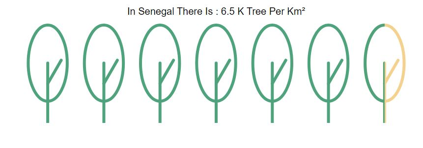

# Tree Graphes
In this project, I tried to create a visualization through the d3.js package

this visualization is about visualizing the number of trees per km².
for example if the **number of tree is equal to 2.5 k** the result should be : 


to view the source code of building this graphe show [index.js](./index.js) file 

to use the graphe 

inside your html file you have to add a div container with an id 

```
  <body>
    <div id="GraphContainer"></div>
  </body>"
```

and inside your script add 

```
const svg=d3.select('#Graphecontainer')
             .append('svg')
             .attr('width',width)
             .attr('height',height)
       
       svg.call( TreeGraphe()
                 .width( width )
                 .height( height )
                 .tree( the number of trees )
                 .stroke_width( width of trees ) 
                 .color_main( the color of trees) 
                 .color_second( the color of tree background ) 
                 .margintop(the top margin for title) 
                 .TreesTitle(title text) 
        )

```
Here is an example 
```
    let width=800
        let height=250
        let tree_number=6.5
        
        const svg=d3.select('.Graphecontainer')
                    .append('svg')
                    .attr('width',width)
                    .attr('height',height)
        
        svg.call(
            TreeGraphe()
                .width(width)
                .height(height)
                .tree(tree_number)
                .stroke_width('6') 
                .color_main('rgb(78, 163, 125)') 
                .color_second('rgb(245, 209, 143)') 
                .margintop(90) 
                .TreesTitle( `In Senegal There Is : ${tree_number} K tree Per Km²` ) 
        )
```
the output:


